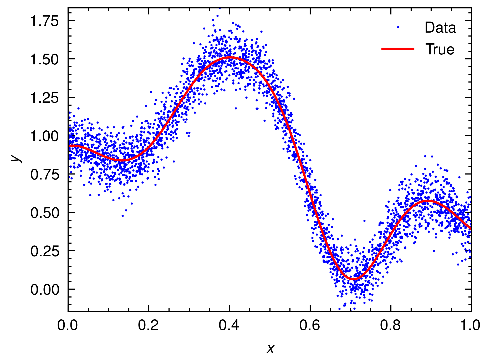
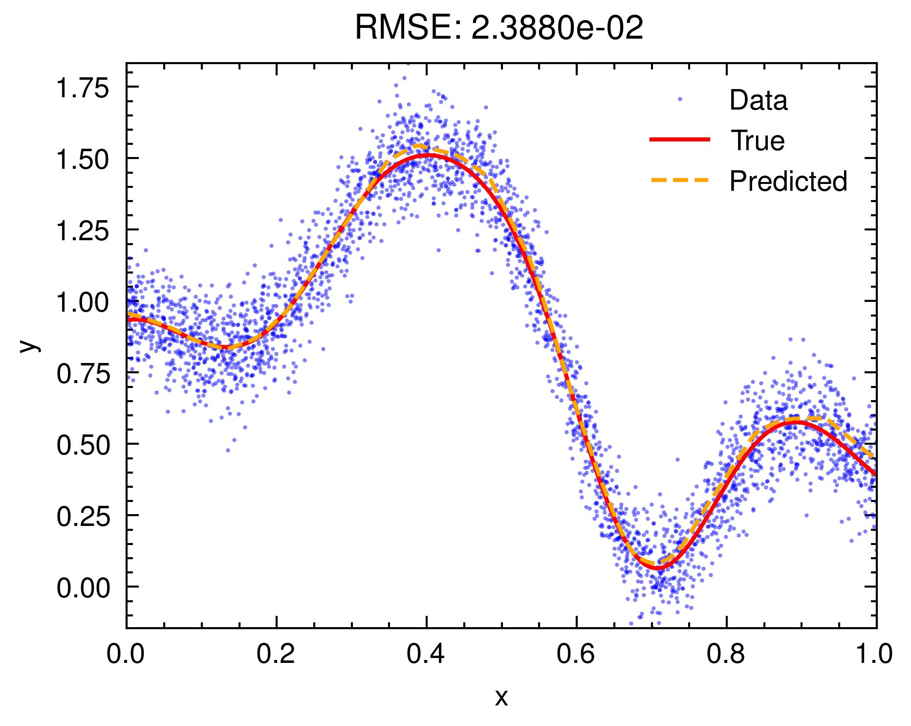

# Deep Learning Tutorial

## Pre-requisites

- uv
  - [How to install uv](https://docs.astral.sh/uv/getting-started/installation/)
- Rust & Cargo
  - [How to install Rust & Cargo](https://rustup.rs/)

## Install dependencies

```bash
# Sync requirements.txt
uv pip sync requirements.txt

# Or fresh install 
uv pip install -U numpy polars wandb torch matplotlib scienceplots
```

## Generate data

```bash
cd data
cargo run --release
```



## Train & Test

```bash
# Activate virtual environment
source .venv/bin/activate

# Train & Draw a plot
python main.py
```


